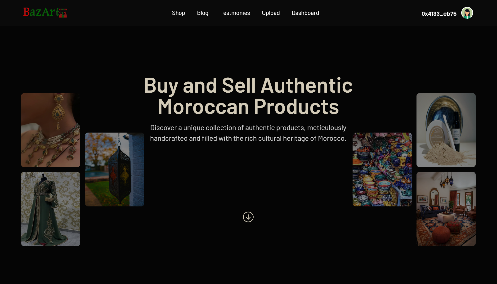

*Decentralized Marketplace for traditional Moroccan Products

Moroccan Web3 Marketplace is a decentralized marketplace for traditional Moroccan products, built with Next.js, Express.js, and Hardhat.js. It empowers Moroccan merchants to reach a global audience and sell their products directly to consumers, without the need for intermediaries. It also provides buyers with a transparent and secure way to purchase traditional Moroccan products.

*Features:

No limits for listing products: Sellers can list as many products as they want, without any fees.
Decentralized escrow solution: Buyers and sellers can securely transact using a decentralized escrow system.

*Technology stack:

Next.js (frontend)
Express.js (offchain data)
Hardhat.js (smart contract development)